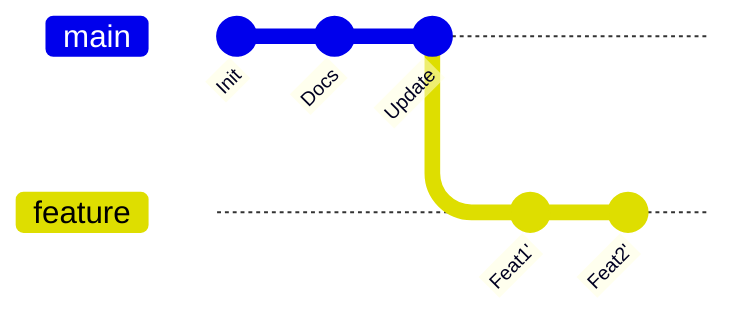

# Git Rebase 深度指南：原理与实战

本文档详细记录了 `git rebase` 的核心概念、工作原理以及实战操作指南，旨在帮助团队成员掌握这一强大的版本控制工具。

## 1. 核心概念：什么是 Rebase（变基）？

**Rebase**（变基）是 Git 中用于整合来自不同分支的修改的一种方式。

这就好比你正在写书的某一章（Feature 分支），而主编同时修改了前言（Master 分支）。
- **Merge（合并）**：你把主编的前言拿过来，加上一句“参考了主编的修改”，然后继续写。这会留下一个“合并记录”。
- **Rebase（变基）**：你暂时把写好的章节收起来，先把主编的新前言放好，然后基于新的前言，把你写的章节重新写一遍。这看起来就像你一开始就是基于最新前言写的。

### 图解原理

#### Rebase 之前 (分叉状态)
```mermaid
gitGraph
   commit id: "Init"
   commit id: "Docs"
   branch feature
   checkout feature
   commit id: "Feat1"
   commit id: "Feat2"
   checkout master
   commit id: "Update"
```

#### Rebase 之后 (线性状态)

*注意：`Feat1'` 和 `Feat2'` 是全新的提交（Hash 值已改变），因为它们的父节点变了。*

## 2. Rebase vs Merge：该选哪个？

| 特性 | Merge (合并) | Rebase (变基) |
| :--- | :--- | :--- |
| **历史形态** | 网状结构，真实记录了所有分叉和合并 | 线性结构，干净整洁，像是一个人顺序开发的 |
| **操作性质** | 非破坏性，只增加新提交 (Merge Commit) | **破坏性**，会重写提交历史 (Rewrite History) |
| **冲突处理** | 一次性解决所有冲突 | 每个提交应用时都可能需要解决冲突 |
| **适用场景** | 公共分支合并 (如 feature -> master) | 个人分支更新 (如 master -> feature) |

**推荐工作流**：
1.  **在个人开发分支上**：经常使用 `git rebase master` 来保持分支基于最新的 master，并保持历史整洁。
2.  **在合并回主干时**：使用 Pull Request (Merge Request) 进行合并（通常使用 Merge Commit 或 Squash Merge）。

## 3. 实战操作指南

### 3.1 基础 Rebase

假设你在 `feature` 分支，想要同步 `master` 的最新代码：

```bash
# 1. 确保当前在 feature 分支
git checkout feature

# 2. 执行变基
git rebase master
```

### 3.2 处理冲突

如果在变基过程中发生冲突，Git 会暂停并提示你解决。

1.  **解决冲突**：编辑冲突文件，保留需要的代码。
2.  **标记解决**：`git add <file>`
3.  **继续变基**：
    ```bash
    git rebase --continue
    ```
    *注意：不要运行 `git commit`，除非你完成了整个 rebase 过程。*

4.  **放弃变基**（如果搞砸了）：
    ```bash
    git rebase --abort
    ```

### 3.3 交互式 Rebase (Interactive Rebase) —— 整理提交历史的神器

当你想要合并多个琐碎的提交，或者修改之前的提交信息时，交互式 Rebase 非常有用。

```bash
# 修改最近的 4 个提交
git rebase -i HEAD~4
```

编辑器会打开一个列表，你可以修改前面的指令：

- **pick (p)**: 保留该提交（默认）。
- **reword (r)**: 保留提交，但修改提交信息。
- **edit (e)**: 保留提交，但暂停 rebase 让你修改文件内容。
- **squash (s)**: 将该提交合并到前一个提交中。
- **fixup (f)**: 类似 squash，但直接丢弃该提交的日志信息（用于修正）。
- **drop (d)**: 丢弃该提交。

**示例：合并提交**
```text
pick 1a2b3c4 feat: add login
squash 5d6e7f8 fix: login bug  <-- 合并到上一个提交
squash 9g0h1i2 fix: typo       <-- 合并到上一个提交
```

## 4. ⚠️ 黄金法则：绝对禁区

> **永远不要在公共分支（Public Branch）上使用 Rebase！**

**为什么？**
Rebase 会修改提交历史（改变 Commit ID）。
如果你重新编写了 `master` 分支的历史，而你的同事已经基于旧的 `master` 拉取了代码，当你推送到远程时，会强制需要 `git push --force`。这会导致同事的代码库陷入混乱，他们的提交可能会丢失。

**记住：** 只有当你独自在这个分支上工作，或者你确定没有其他人基于此分支开发时，才使用 Rebase。

## 5. 常见问题排查

- **Q: Rebase 过程中出现大量冲突怎么办？**
  - A: 如果冲突太复杂，可以先 `git rebase --abort` 放弃。考虑使用 `git merge`，或者检查是否选错了基底分支。

- **Q: 即使没有冲突，Git 也要我处理某些文件？**
  - A: 有时候是文件模式（权限）变更或重命名导致的，仔细检查 `git status` 的提示。

---
*Generated by Git Expert Assistant*
