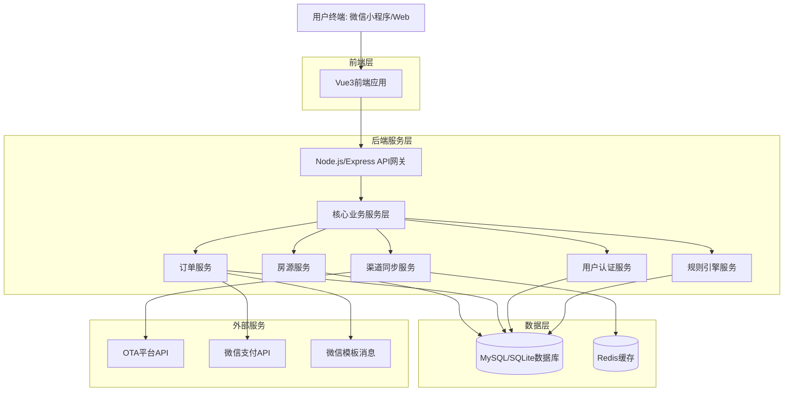
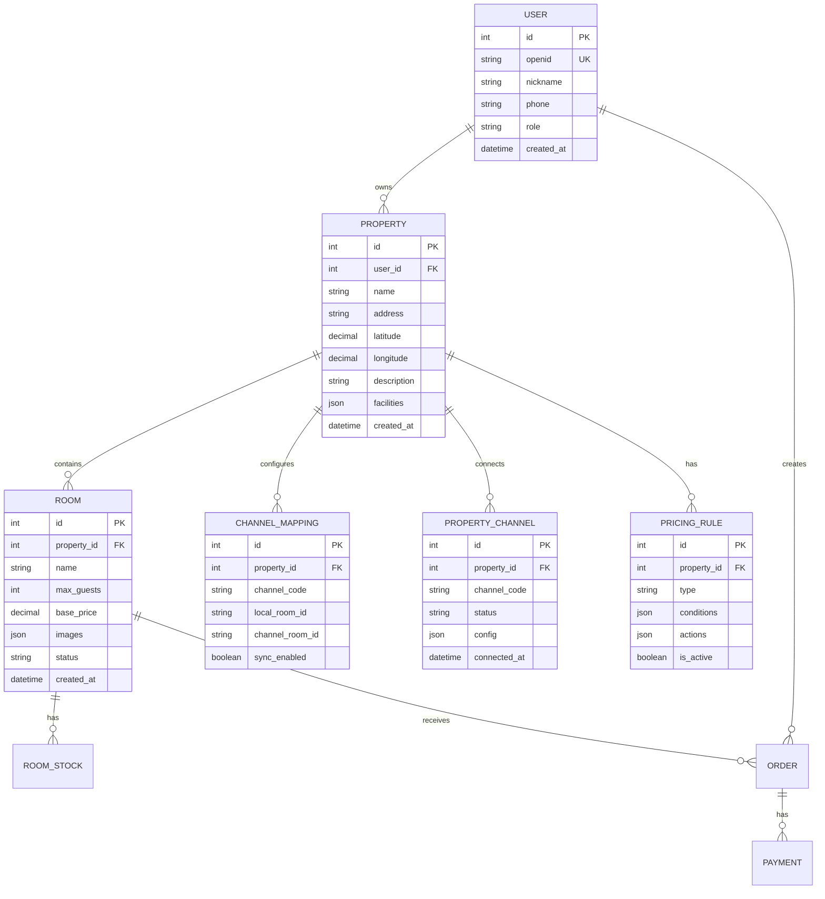

# 宝寓PMS技术解决方案

## 1. 系统架构设计

### 1.1 整体架构

### 1.2 技术选型说明
- **前端**: Vue 3 + TypeScript + Vite + Element Plus + Pinia
  - **图表**: ECharts (营收分析)
  - **拖拽**: HTML5 Drag and Drop API (房源映射)
  - **实时**: Socket.io-client
- **后端**: Node.js + Express.js + TypeScript
  - **实时**: Socket.io (订单/房态推送)
  - **任务调度**: node-schedule (定时同步/规则执行)
- **数据库**: MySQL (生产环境) / SQLite (开发测试)
- **缓存**: Redis (房态实时同步)
- **认证**: JWT + 微信OAuth2.0
- **部署**: Docker容器化部署

## 2. 数据库设计

### 2.1 核心数据模型

## 3. 关键技术实现方案 (Key Implementation Details)

### 3.1 OTA 授权与回调 (OAuth2.0 Flow)
1.  **前端发起**: 用户点击“连接携程”，前端请求后端 `getAuthUrl`。
2.  **获取链接**: 后端根据渠道配置生成带 `redirect_uri` (指向前端 Callback 页) 的授权链接。
3.  **用户授权**: 用户跳转至 OTA 页面确认授权。
4.  **回调处理**: 
    - OTA 重定向回前端 `/channels/callback?code=xxx`。
    - 前端提取 `code`，调用后端 `handleAuthCallback`。
    - 后端使用 `code` 换取 `access_token` 和 `refresh_token`，加密存储至数据库。
5.  **完成绑定**: 前端接收成功响应，刷新渠道列表状态。

### 3.2 房源映射交互 (Drag & Drop)
- **技术**: 原生 HTML5 Drag and Drop API。
- **布局**: Flexbox 双栏布局。
- **逻辑**:
    - `draggable="true"`: 右侧渠道房源列表项。
    - `ondragstart`: 传输房源数据 (JSON)。
    - `ondrop`: 左侧本地房源接收数据，调用 API 更新映射关系。
    - `ondragover`: 允许放置。
- **反馈**: 拖拽时高亮目标区域；映射成功后右侧房源变灰或标记“已映射”。

### 3.3 实时订单与房态同步 (WebSocket)
- **协议**: Socket.io (基于 WebSocket)。
- **事件**:
    - `order:new`: 新订单推送，前端弹窗提醒 + 列表高亮。
    - `stock:update`: 房态变更，日历视图实时刷新格子颜色。
- **机制**:
    - 后端接收 OTA Webhook -> 解析数据 -> 更新数据库 -> 广播 WebSocket 事件给对应 Property 的在线客户端。
    - 前端组件 (`Orders.vue`, `Calendar.vue`) `onMounted` 订阅事件，`onUnmounted` 取消订阅。

### 3.4 大数据列表优化
- **场景**: 订单列表、日志列表可能包含上千条记录。
- **方案**: 虚拟滚动 (Virtual Scrolling)。
- **实现**: 只渲染视口内可见的 DOM 元素（+缓冲区），滚动时动态复用 DOM。
- **库**: `vue-virtual-scroller` 或 Element Plus Table 的虚拟滚动模式。

### 3.5 规则引擎设计
- **结构**: 采用 `Condition-Action` 模式。
    - **Condition**: `{ field: "stock", operator: "eq", value: 0 }` (库存为0)
    - **Action**: `{ type: "close_room", scope: "all_channels" }` (关闭所有渠道)
- **执行时机**:
    - 定时任务 (Cron Job) 每晚计算次日房价。
    - 实时触发 (Event Driven) 当库存变动时触发规则检查。
